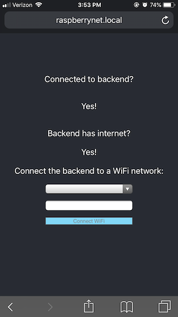

# Control a Raspberry Pi with your phone
This is a simple example of how to get a phone and raspberry pi talking to each other wirelessly using common web technologies. This example uses Flask and React, but either could be replaced with your preferred stack. This uses:

* Flask backend running via gunicorn that starts up on boot through systemd
* React frontend hosted by nginx which is sent to the phone when it connects to the Pi

The included example shows how to use the app (on something like a phone) to connect your pi to a WiFi network.


## Requirements
* Raspberry Pi (tested on a Raspberry Pi 3 Model B+)
* SD card with Raspbian (tested on Stretch Lite 04-08 image)
* A WiFi dongle (tested on [this one](https://www.adafruit.com/product/2810))
* A phone that can connect to WiFi (tested on iPhones 5+)
* Monitor/keyboard, or an SSH connection

## Set up

* Download the latest [raspbian image](https://www.raspberrypi.org/downloads/raspbian/) and flash it to an SD card
* Insert your flashed SD card into your Raspberry Pi and connect it to a monitor and keyboard
* Log in to the OS (default username: `pi` default password: `raspberry`)
* [Connect your pi to the internet](https://www.raspberrypi.org/documentation/configuration/wireless/wireless-cli.md)
* [Install Ansible](https://docs.ansible.com/ansible/latest/installation_guide/intro_installation.html#latest-releases-via-apt-debian)
  * You may need to install dirmngr first to do this (`sudo apt-get -y install dirmngr`)
  * You may also need to use the url `hkp://keyserver.ubuntu.com:80` for the Ubuntu keyserver
* Download this repository to your pi and make a note of the location (e.g. `/home/pi/raspberrypi-iot`)
* Fill this location name in [`system/system.yaml`](system/system.yaml) on line 5
* Configure udev (see below)
* Reconnect to your WiFi now that udev has changed some of the wlan assignments
  * The outgoing wifi should now be on `wlan1`. To set its WiFi settings, copy your `/etc/wpa_supplicant/wpa_supplicant.conf` (which should have your WiFi settings) to `/etc/wpa_supplicant/wpa_supplicant-wlan1.conf`. Then run `wpa_cli -i wlan1 reconfigure`. You should have internet again now.
  * Note: `raspi-config` cannot be used to change the WiFi settings anymore since the wlan assignments have changed
* Run `sudo ansible-playbook system/system.yaml`. This will set up the WiFi access point as well as install the example frontend and backend services.
* Restart the pi

If everything worked, then you should be able to see the WiFi network `raspberrynet` from any device capable of looking for WiFi. You should be able to connect to it with the password `raspberrynet`. From your connected device, go to `raspberrynet.local:80` in a browser (or just `raspberrynet.local`) and you should see the frontend running on your pi! If your pi has ssh enabled, you should also be able to `ssh pi@raspberrynet.local`.

By default, the wifi connection and hostname of the pi are `raspberrynet`. This can be changed by replacing `raspberrynet` in the following files, then running the Ansible again:
* [system/etc/hosts](system/etc/hosts)
* [system/etc/hostname](system/etc/hostname)
* [system/etc/hostapd/hostapd.conf](system/etc/hostapd/hostapd.conf)

Try connecting your pi to a different WiFi network, or taking it to a library. Because the internet connection is forwarded to the phone, you can now use your phone to get the pi past any pesky splash screens asking you to agree to terms. Congrats, you're controlling your Raspberry Pi with your phone!


### Configuring udev
This is the trickiest part about getting this set up correctly. The pi does not by default persist wlan assignments, so if the pi is restarted, these might get switched. Because there are two WiFi chips (the one on the pi itself and a WiFi dongle via USB), we have to tell the pi which one will be the access point, and which one will be the outgoing WiFi. The on board WiFi chip of the Raspberry 3 is capable of being an access point, whereas not all WiFi dongles are, so we assign the access point to the on board chip. The WiFi dongle will then be responsible for the outgoing internet connection. 

In this set up, we call the on board chip/access point `ap0` and our dongle/outgoing internet `wlan1`.

You will need to configure your [udev rules](system/etc/udev/rules.d/72-wifi.rules) to be as specific as possible to grab your WiFi dongle. The current ones in that file work for the WiFi dongle linked above by matching on `idVendor`, `idProduct`, and `removable`. You could use the MAC address of your WiFi dongle instead, but this gets tricky to scale.

To find information about your WiFi dongle:
```
# output info on all usb devices
> lsusb

# look for your WiFi dongle and its bus number and device number
# example output:
# Bus 001 Device 005: ID 0bda:8179 Realtek Semiconductor Corp.... Wireless Network Adapter
# get detailed info on this usb device (using BUS then DEVICE number)
> udevadm info /dev/bus/usb/001/005
```
This should list all sorts of attributes about your WiFi dongle to match on.

Once you've changed your udev rules, you can see if they worked by running:
```
udevadm control --reload-rules && udevadm trigger
```
You will likely also need to unplug/plug in the WiFi dongle again. Or you could reboot the pi for the same effect.

If your udev assignment worked, you should see both `wlan1` and `ap0` as entries when you run `ifconfig`.

Further resources:
* [Persisting wlan assignments](https://www.raspberrypi.org/forums/viewtopic.php?f=29&t=55527)
* [Getting info on USB devices](https://unix.stackexchange.com/questions/271878/is-it-possible-to-get-the-devtype-of-a-usb-wifi-device)
